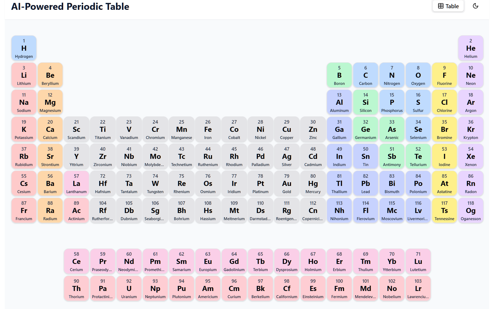

# Interactive Periodic Table 🧪

A comprehensive interactive periodic table application with detailed element information and dark/light mode support. Explore the elements like never before!

## ✨ Features

-   **Complete Periodic Table**: Interactive display of all 118 elements with color-coding by category 🎨.
-   **Detailed Element Information**: Discover properties, earthly items, and common uses for each element 📖.
-   **Dark/Light Mode**: Toggle between dark 🌙 and light ☀️ themes with system preference detection.

## 📸 Screenshots

### Periodic Table View


## 🚀 Setup Instructions

### Prerequisites

-   Node.js (v16 or higher) 🟢
-   npm or yarn 🧶

### Installation

1.  Download and extract the project zip file 📁.
2.  Navigate to the project directory:
    ```bash
    cd periodic-table-ai/periodic-table-ai
    ```
3.  Install dependencies:
    ```bash
    npm install
    ```
    or with yarn:
    ```bash
    yarn install
    ```

### Running the Application

1.  Start the development server:
    ```bash
    npm run dev
    ```
    or with yarn:
    ```bash
    yarn dev
    ```
2.  Open your browser and navigate to:
    ```
    http://localhost:5173
    ```

### Building for Production 🏗️

To create a production build:

```bash
npm run build
```


The build files will be in the dist directory and can be served using any static file server.

## 💡 Using the Application

### Navigating the Periodic Table
- The main page displays the complete periodic table with all 118 elements.
- Elements are color-coded by category (metals, non-metals, noble gases, etc.).
- Click on any element to view detailed information.

### Element Details
Each element page shows comprehensive properties including:
- Atomic mass, category, group, period
- Electron configuration, density, melting/boiling points
- Earthly items and their uses

### Theme Toggle
- Click the sun/moon icon ☀️/🌙 in the top-right corner to switch between light and dark modes.
- The application automatically detects your system preference on first load.

## 🛠️ Technical Details
- Built with React, TypeScript, and Vite ⚛️
- Styled with Tailwind CSS and shadcn/ui components ✨
- Uses React Router for navigation 🗺️
- Local storage for theme preference persistence.

## 📝 Notes
- The application runs entirely in the browser with no backend requirements.
